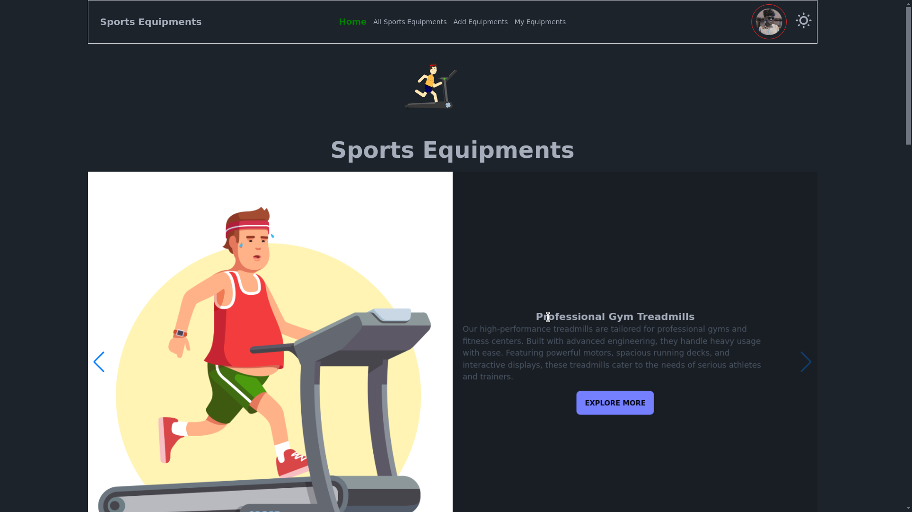

# Equi-Store - Firebase React Project


## Project Description
This project is built using React, Firebase, and other modern front-end libraries and tools like Tailwind CSS, Vite, and DaisyUI. The application allows users to interact with Firebase services such as authentication and data storage. It also features animations and dynamic visual effects with the help of Lottie and TSParticles.

## Features
- **Firebase Authentication**: User sign-up and login functionality.
- **Firebase Firestore**: Store and manage application data.
- **Animations**: Use of Lottie animations for a dynamic user experience.
- **Particles Effects**: Integration of TSParticles for interactive background effects.
- **Responsive Design**: Optimized for mobile and desktop with Tailwind CSS and DaisyUI components.
- **User Notifications**: Toast notifications via `react-toastify`.
- **Modal Alerts**: Sweet alert integration for error handling and success messages.

## Tech Stack
- **Frontend**: React, React Router DOM, React Icons
- **Styling**: Tailwind CSS, DaisyUI
- **State Management**: React Context (or local state)
- **Animation**: Lottie, TSParticles
- **Firebase**: Firestore, Authentication
- **UI Enhancements**: SweetAlert2, react-toastify, react-awesome-reveal
- **Build Tool**: Vite
- **Code Quality**: ESLint for linting

## Installation

1. Clone this repository:
    ```bash
    git clone https://github.com/your-username/assignment-10.git
    ```

2. Navigate to the project folder:
    ```bash
    cd assignment-10
    ```

3. Install the dependencies:
    ```bash
    npm install
    ```

4. Create a `.env` file in the root of the project and add the Firebase configuration keys as shown below:

    ```bash
    VITE_apiKey=YOUR_FIREBASE_API_KEY
    VITE_authDomain=YOUR_FIREBASE_AUTH_DOMAIN
    VITE_projectId=YOUR_FIREBASE_PROJECT_ID
    VITE_storageBucket=YOUR_FIREBASE_STORAGE_BUCKET
    VITE_messagingSenderId=YOUR_FIREBASE_MESSAGING_SENDER_ID
    VITE_appId=YOUR_FIREBASE_APP_ID
    ```

5. Run the project locally:
    ```bash
    npm run dev
    ```

6. The application will be live on [http://localhost:5173](http://localhost:5173).

## Firebase Configuration
Ensure that your Firebase project is properly configured with the following Firebase services:
- **Authentication**: Enable Email/Password sign-in method.
- **Firestore**: Set up your Firestore database to store data as per your application’s requirements.

### Example Firebase configuration:

```js
const firebaseConfig = {
    apiKey: import.meta.env.VITE_apiKey,
    authDomain: import.meta.env.VITE_authDomain,
    projectId: import.meta.env.VITE_projectId,
    storageBucket: import.meta.env.VITE_storageBucket,
    messagingSenderId: import.meta.env.VITE_messagingSenderId,
    appId: import.meta.env.VITE_appId
};
```

## Development

- To lint your code, run:
    ```bash
    npm run lint
    ```

- To build the project for production:
    ```bash
    npm run build
    ```

## Contributions

Feel free to fork this project and contribute by submitting pull requests or opening issues if you find any bugs.
